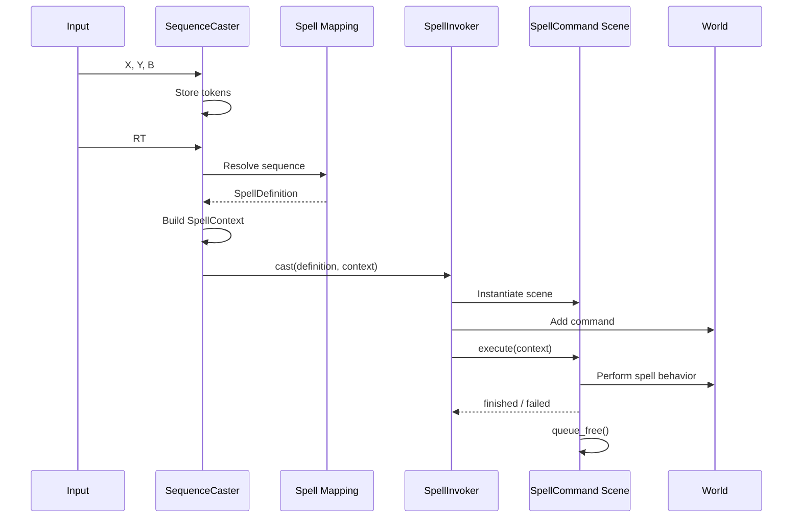
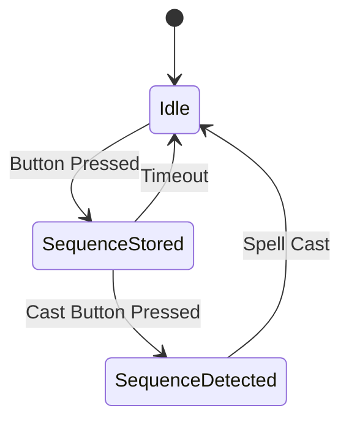

# Feature Overview

The player must be able to cast magics combining buttons which will be named "Sequence Casting" through the documentation. The Sequence Casting will be a system that allows the player to combine different buttons to create unique magical effects. Each button will represent a different magical element or action, and the combination of these buttons will result in various spells or abilities.

The used buttons from the controller will be:
- **X Button**: Represents the Attack action.
- **Y Button**: Represents the Interaction/Push action.
- **B Button**: Represents the Move action.

Note: for the documentation we gonna mention the joystick buttons as is on Xbox Controller, but the final implementation will be adapted to the platform the game is released on.

The player will be able to combine these buttons in different sequences to create unique magical effects. For example, pressing the X button followed by the Y button may result in a fireball spell, while pressing the B button followed by the X button may result in a teleportation spell.

In order to successfully cast a spell, the player must input the correct sequence of button presses and a additional cast button, which will be the **RT Button**. The player will have a limited amount of time to input the sequence, and if they fail to do so, the spell will not be cast.

# Implementation Details

We gonna need to implement a system that can detect the sequence of button presses and trigger the corresponding magical effect. This will involve creating a mapping of button sequences to specific spells or abilities, as well as implementing a timeout mechanism to ensure that the player has a limited window to input and cast the sequence, and that the sequence is recognized correctly.

For the timeout mechanism, we gonna need to create buffers that will store the button presses, and a timer that will reset the buffer after a certain amount of time has passed since the last button press. This will ensure that the player has to input the sequence quickly and accurately in order to successfully cast the spell.

## Initial Implementation Plan

In order to bootstrap the Sequence Casting system, we will start with a basic implementation that allows for a limited number of spells to be cast.

1. Create a mapping of button sequences to specific spells or abilities.
2. Implement a sequence detection system that can recognize the button presses.
3. Implement a timeout mechanism that resets the button press buffer after a certain amount of time has passed since the last button press.
4. Create a basic user interface that displays the current sequence of button presses.
5. Implement a cast button that the player must press to finalize the spell casting.
6. Implement the basic magical effects for the initial set of spells or abilities.
    - 6.1. Implement the projectile spell for the basic attack sequence (X)
    - 6.2. Implement the push spell for the basic interaction sequence (Y)
    - 6.3. Implement the dash spell for the basic move sequence (B)
7. Test the system to ensure that the button sequences are recognized correctly and that the magical effects are triggered as expected.

## Division of Responsibilities

SequenceCaster
- Understands input sequences
- Does not understand spell behavior

SpellDefinition
- Stores sequence and metadata
- References a PackedScene
- Has no runtime state

SpellInvoker
- Instantiates commands
- Starts and observes them
- Has no projectile, push, or dash logic

SpellCommand scene
- Owns the spell's full behavior
- Owns its temporary state
- Owns its lifetime
- Can contain visuals, audio, timers, and collisions

SpellContext
- Provides the dependencies and cast-specific data
- Prevents spells from searching arbitrary nodes throughout the tree

## Mapping

We gonna use a HashMap to store the mapping of button sequences to specific spells or abilities. The key will be a string representing the sequence of button presses, and the value will be an object representing the corresponding spell or ability. This DSA will allow for an efficient O(1) lookup time for the mapping, which is important for ensuring that the system can recognize the button sequences quickly and accurately.

The object representing the spell or ability will contain information such as the name of the spell, the magical effect it produces, and any additional properties or parameters that may be required for the spell to function correctly.

We can create an interface that defines the structure of the spell or ability object, and then create concrete implementations for each specific spell or ability. This allows for easy extensibility and maintainability of the system, as new spells or abilities can be added by simply creating new implementations of the interface and adding them to the mapping.

## Sequence Detection System

We gonna implement a sequence detection system that can recognize the button presses and determine if they match any of the defined sequences in the mapping. This will involve creating a buffer to store the button presses, as well as a timer to reset the buffer after a certain amount of time has passed since the last button press.

This will works as a Finite State Machine (FSM) that will transition between different states based on the button presses and the timeout mechanism. As follows:

## UI

In this initial implementation, we will create a basic user interface that displays the current sequence of button presses. This will allow the player to see the sequence they are inputting and ensure that they are pressing the correct buttons in the correct order.

This will be on top of the player's character, and will display the button icons in the order they were pressed. The UI will also display a timer that counts down the time remaining for the player to input the sequence before it resets.

## Initial Spells

The spell implementation will be self-contained, and they will be singletons that will be registered in the mapping. 

The design pattern used for the spell implementation will be the Factory Method pattern, which will allow for easy creation of new spells or abilities by simply creating new implementations of the spell interface and adding them to the mapping.

### Projectile Spell (X)

The projectile spell will be triggered by pressing the X button followed by the RT button. This spell will create a magical projectile that will be launched in the direction the player is facing. The projectile will have a certain speed and damage value, and will disappear after a certain distance or upon hitting an enemy or obstacle.

### Push Spell (Y)

The push spell will be triggered by pressing the Y button followed by the RT button. This spell will create a magical force that will push enemies or objects away from the player. The push effect will have a certain range and strength, and will affect all enemies or objects within that range.

### Dash Spell (B)

The dash spell will be triggered by pressing the B button followed by the RT button. This spell will allow the player to quickly dash in the direction they are facing, allowing them to evade attacks or close the distance to enemies. The dash will have a certain speed and distance, and will have a cooldown period before it can be used again.

Note: for now, we do not will implement the cooldown period, but it will be added in future iterations of the system to balance the gameplay and prevent spamming of the dash ability.

## Unit Testing

All the components of the Sequence Casting system will be unit tested to ensure that they function correctly and as expected. This will include testing the mapping of button sequences to spells, the sequence detection system and the timeout mechanism.

We should use the GUT (Godot Unit Test) framework to create and run the unit tests for the Sequence Casting system. This will allow us to easily test the different components of the system and ensure that they are working correctly.

