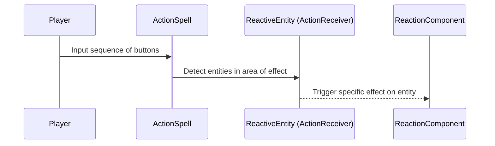

# Feature Overview

The player must be able to cast spells that interact with other entities in the game world, such as push, pull, which will be named "Action Spells" through the documentation.

The Action Spells will works by discharging an action in a area of effect (which commonly will be the area in front of the player), which will trigger a specific effect on the entities that are affected by the spell. The entities that are affected by the spell will be named "Reactive Entities" through the documentation. The Reactive Entities will be any entity that has a specific behavior when affected by an Action Spell, such as being pushed, pulled, or having their state changed.

The Action Spells will primarly begin they sequence with the **Y Button** (Interaction/Push action), and will be followed by a specific sequence of buttons that will determine the specific effect of the spell. The player will have a limited amount of time to input the sequence, and if they fail to do so, the spell will not be cast.

# Implementation Details

- Action spells inherit from SpellCommand, optionally through an ActionSpell base class. ActionSpell owns common area-query and action-dispatch behavior. Concrect spells construct the action data but do not modify affected entities directly. The action data is routed to the affected entities, which own their own reaction behavior.
- Reactive entities are composed with an ActionReceiver and zero or more reaction components. The receiver routes incoming action data to those components. Each reaction component determines wheter it supports the action and how it modifies its owning entity.

Flow of the Action Spells:

# Implementation Plan

For the initial implementation of the Action Spells, we will start with a basic implementation of push action spell, which will be the first Action Spell that the player will be able to cast. The push action spell will push the Reactive Entities away from the player in a specific direction.

1. Define ActionData, the data structure that will hold the information about the Action Spell that will be exchanged between action spells and the receivers.
2. Create ActionReceiver as a reusable entity component that routes ActionData to composed reaction components.
3. Create ActionSpell extends SpellCommand to query its Area2D, deduplicate the ActionReceivers, and dispatch actions.
4. Create PushSpell extends ActionSpell to implement the specific behavior of the push action spell, such as the cast direction, source, origin and strength of the push.
5. Create PushReaction extends ReactionComponent wich accepts push actions and applies entity-specific push behavior, such as applying a force to the entity in the direction of the push.
6. Create the push spell scene, including its area and collision shape.
7. Create and register the push SpellDefinition using the intended Y-button sequence.
8. Add ActionReceiver and PushReaction to an initial test entity.
9. Test no targets, one target, several targets, etc.