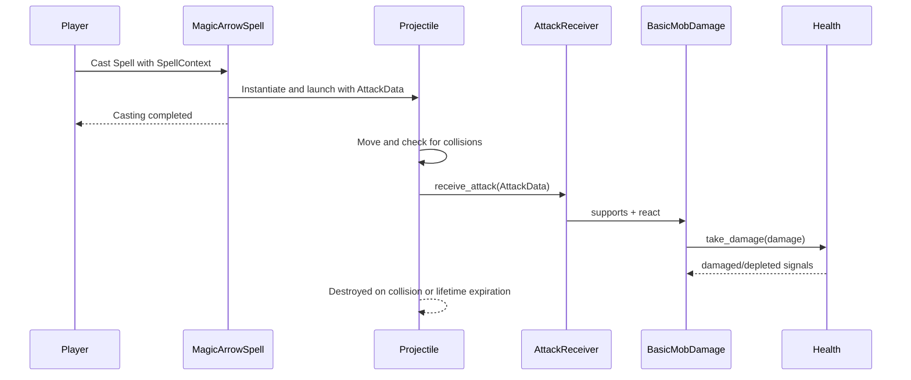

# Feature Overview

The player must be able to cast spells to attack other entities in the game world, which will be named "Attack Spells" through the documentation. The initial implementation of the Attack Spells will be a projectile spell that will be named "Magic Arrow" through the documentation.

The Attack Spells will work by discharging a projectile in a specific direction, which will trigger a specific effect and damage on the entities that are affected by the spell. The entities that are affected by the spell will be named "Target Entities" through the documentation. The Target Entities will be any entity that has a specific behavior when affected by an Attack Spell, such as taking damage, being destroyed, or having their state changed.

The Attack Spells will primarily begin their sequence with the **X Button** (Attack), and will be followed by a specific sequence of buttons that will determine the specific effect of the spell. 

# Implementation Details

- Attack spells inherit from SpellCommand, optionally through an AttackSpell base class. AttackSpell owns common projectile-query.
- Concrete spells construct the projectile data but do not modify affected entities directly. The projectile data is routed to the affected entities, which own their own damage/state behavior.
- Target entities are composed with a AttackReceiver and zero or more damage components. The receiver routes incoming projectile data to those components. Each damage component determines whether it supports the projectile and how it modifies its owning entity.
- Entities that have life will have a Health component that will be used by the damage components to apply damage to the entity. These will be called mob through the documentation. The Health component will be a reusable entity component that will be used by the damage components to apply damage to the entity.

| Component | Responsibility |
|-----------|----------------|
| MagicArrowSpell | Read SpellContext, instantiate and launch a projectile |
| Projectile | Movement, collisison, range/lifetime, and deciding when it disappears |
| AttackData | Values describing the hit: damage, source, type, direction, etc. |
| AttackReceiver | Receives AttackData and routes it to the appropriate DamageComponents |
| DamageMobDamage | Convert a supported attack into health.take_damage(...) |
| Health | Track health, clamp values, and emit depleted (death) events |

_Note: for other spec descriptions I should use this table pattern; also remember to decouple DTOs such the AttackData_

# Implementation Plan

- Implement the projectile system, including the projectile scene, collision shape, and movement.
- Create AttackReceiver as a reusable entity component that routes projectile data to composed damage components.
- Create AttackSpell extends SpellCommand to query its projectile path
- Create MagicArrowSpell extends AttackSpell to implement the specific behavior of the magic arrow spell, such as the cast direction, source, origin, and damage of the projectile.
- Create BasicMobDamage extends DamageComponent which accepts magic arrow projectiles and applies entity-specific damage behavior, such as reducing health.
- Create the magic arrow spell scene, including its projectile and collision shape.
- Create and register the magic arrow SpellDefinition using the intended X-button sequence.
- Add AttackReceiver and BasicMobDamage to an initial test entity (dummy)
- Test no targets, one target, several targets, etc.
- The projectile must be able to be destroyed when it collides with a target entity or other obstacle

## Recommended order

1. Define initial behavior rules

    Decide these before coding:
    - Projectile stops at the first target or obstacle. 
        - Yes
    - It cannot damage its caster.
        - Yes
    - It deals damage only once.
        - Yes
    - It expires after a fixed distance or lifetime.
        - Yes, configurable.
    - An ignored attack still consumes the projectile—or not. For simplicity, I suggest yes.
        - Yes, for simplicity.

2. Implement AttackData

    Keep the initial contract small:

    source
    damage
    direction
    attack_type

    Add status effects, teams, critical hits, and metadata only when needed.

3. Implement Health

    It should:
    - Hold current and maximum health.
    - Provide take_damage(amount).
    - Clamp health at zero.
    - Emit changed and depleted.
    - Emit depleted only once.

    Test this independently before involving collision.

4. Implement death behavior separately

    Create a simple DestroyOnDeath component for the dummy. It references Health, listens for depleted,
    and destroys the owning entity.

    This verifies the composition:

    Entity
    ├── Health
    └── DestroyOnDeath

5. Implement the attack reaction pipeline

    In this order:

    AttackReaction
    └── BasicMobDamage

    BasicMobDamage references Health and calls take_damage() for supported attacks.

6. Implement AttackReceiver

    The receiver should:
    - Extend Area2D.
    - Find its composed AttackReaction children.
    - Call reactions that support the incoming attack.
    - Return whether at least one reaction handled it.
    - Emit attack_received or attack_ignored.

    At this point, test the entire damage pipeline without a projectile:

    receiver.receive_attack(test_attack)

    This isolates component problems from physics problems.

7. Build the dummy target scene

    Compose it as:

    Dummy
    ├── Sprite2D
    ├── Health
    ├── DestroyOnDeath
    └── AttackReceiver (Area2D)
        ├── CollisionShape2D
        └── BasicMobDamage

    Assign the dummy’s Health to BasicMobDamage through an exported reference.

8. Implement MagicArrowProjectile

    Start with the concrete projectile rather than a large generic projectile framework.

    It should own:
    - Direction and speed.
    - Movement.
    - AttackData.
    - Target and obstacle collision.
    - Maximum lifetime or distance.
    - A consumed flag preventing duplicate hits.
    - Its own destruction.

    Configure separate collision layers for attack receivers and world obstacles.

9. Implement MagicArrowSpell

    Have it extend SpellCommand directly initially. It should:
    - Instantiate the projectile scene.
    - Create its AttackData.
    - Initialize position and direction from SpellContext.
    - Add it under context.effect_parent.
    - Call complete() after launching it.

    The projectile continues independently after the spell command completes.

10. Register the spell

Only after manual projectile tests work:

- Create the Magic Arrow spell scene.
- Create its SpellDefinition.
- Configure the X-button sequence.
- Add it to the player’s available spells.

11. Test behavior in increasing complexity

Test in this order:

1. Projectile expires without hitting anything.
2. Projectile hits a wall.
3. Projectile hits a receiver without compatible reactions.
4. Projectile damages the dummy.
5. Repeated arrows reduce health correctly.
6. Health reaches exactly zero and emits depletion once.
7. Several aligned targets: only the nearest is hit.
8. Projectile starts near the caster without hitting the caster.
9. Projectile cannot register multiple collisions in one physics frame.
10. Extract abstractions only afterward

Once Magic Arrow works, evaluate whether another spell needs the same spawning logic. Then you can
extract something such as:

SpellCommand
└── ProjectileSpell
    ├── MagicArrowSpell
    └── FutureProjectileSpell