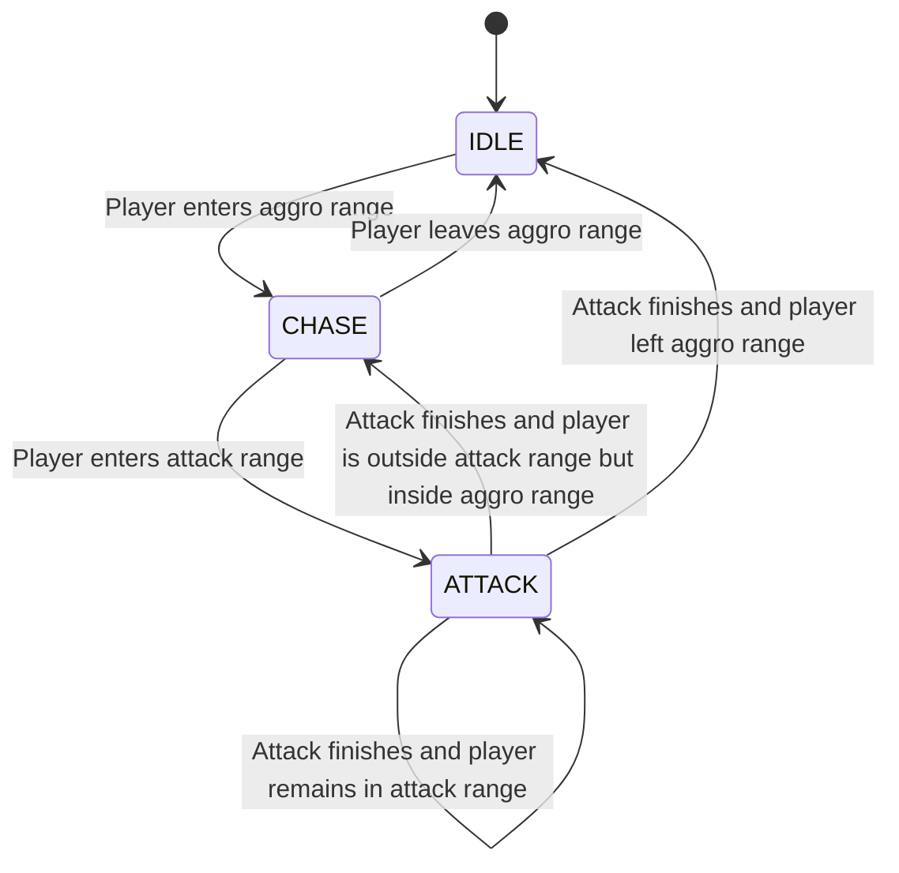
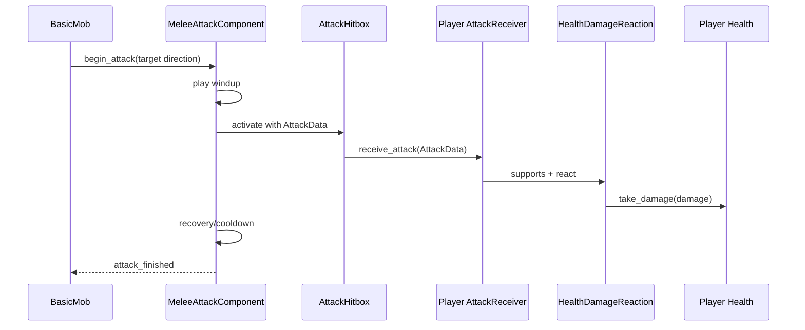
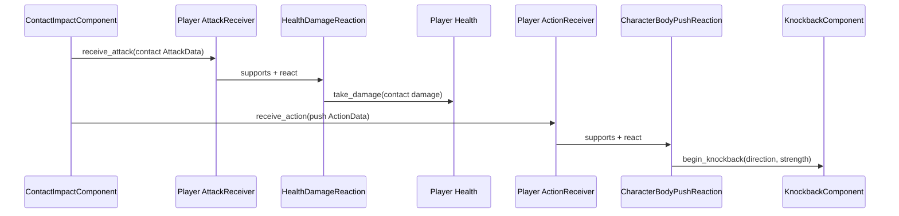

# Feature Overview

Implement an initial mob with a small, playable behavior loop. The first mob remains idle until the player approaches, chases the player while they are within its aggro range, and performs a melee attack when they enter its attack range. Physically colliding with the mob also damages the player and knocks them away from the mob.

The mob must also participate in the existing attack, action, and health systems so that combat effects are exchanged through reusable receiver components.

The initial implementation is one concrete `BasicMob`. It should use composed movement, detection, attack, and health components without introducing a generic AI framework or a hierarchy of mob subclasses.

## Behavior Rules

- The mob begins in the `IDLE` state at its spawn position.
- The mob does not patrol.
- When the player enters its aggro range, the mob enters `CHASE` and follows the player horizontally.
- When the player leaves its aggro range, the mob returns to `IDLE` and stops at its current position. It does not return to its spawn position.
- When the player enters its attack range, the mob stops chasing and enters `ATTACK`.
- The attack range must be smaller than the aggro range.
- When the player leaves the attack range but remains inside the aggro range, the mob returns to `CHASE` after the current attack finishes.
- When the player remains inside the attack range, the mob can begin another attack after the current attack and its recovery/cooldown finish.
- When the player leaves the aggro range, the mob returns to `IDLE` after the current attack finishes.
- The mob moves only horizontally during chase. Gravity continues to apply normally.
- The mob faces its current movement or attack direction.
- The player must be identified through the `player` group rather than through a hard-coded scene path.
- When the player physically collides with the mob, the player receives contact damage and a horizontal knockback directed away from the mob.
- One continuous contact must not apply damage or knockback every physics frame.



# Implementation Details

## Scene Composition

The initial mob should be composed approximately as follows:

```text
BasicMob (CharacterBody2D)
├── AnimatedSprite2D
├── CollisionShape2D
├── HorizontalMovementComponent
├── GravityComponent
├── AggroDetector (Area2D)
├── AttackRangeDetector (Area2D)
├── MeleeAttackComponent
│   └── AttackHitbox (Area2D)
├── ContactImpactComponent
│   └── ContactArea (Area2D)
├── Health
├── DestroyOnDeath
└── AttackReceiver
    ├── CollisionShape2D
    └── HealthDamageReaction
```

| Component | Responsibility |
|-----------|----------------|
| `BasicMob` | Own the `IDLE`, `CHASE`, and `ATTACK` state, select movement direction, update presentation, and coordinate the composed components. |
| `HorizontalMovementComponent` | Calculate horizontal acceleration and deceleration. Reuse the existing movement component where practical. |
| `GravityComponent` | Calculate vertical velocity while the mob is airborne. Reuse the existing gravity component. |
| `AggroDetector` | Report when a valid player enters or leaves the aggro area. |
| `AttackRangeDetector` | Report whether the acquired target is close enough to attack. |
| `MeleeAttackComponent` | Own attack windup, active timing, recovery/cooldown, and creation of `AttackData`. |
| `AttackHitbox` | Deliver the current `AttackData` to overlapping `AttackReceiver` areas during the active attack moment. |
| `ContactImpactComponent` | Detect contact with a valid player, enforce the per-target contact cooldown, and dispatch separate damage and push data. |
| `ContactArea` | Define the physical overlap in which contact effects can be triggered. |
| `AttackReceiver` | Route incoming attacks to the mob's composed attack reactions. |
| `HealthDamageReaction` | Convert supported attacks into damage applied to `Health`. |
| `Health` | Track the mob's current and maximum health. |
| `DestroyOnDeath` | Remove the mob when its health is depleted. |

An enum and a small state transition function inside the `BasicMob` script are sufficient for this MVP. Separate state nodes or a reusable state-machine framework should only be extracted when additional mobs demonstrate a need for them.

## Target Detection

- Both detection areas should use collision masks appropriate for finding the player.
- A detected body is only a valid target if it belongs to the `player` group.
- The implementation assumes a single player. Multi-target selection is outside the MVP.
- The mob must not search for the player through a fixed path such as `$"../player"`.
- The target reference must be cleared safely if the player leaves the tree.

## Chase Movement

- While chasing, the mob chooses a horizontal direction from the difference between its position and the player's position.
- The existing `HorizontalMovementComponent` should calculate its horizontal velocity using mob-specific exported speed, acceleration, and deceleration values.
- The existing `GravityComponent` should calculate vertical velocity.
- The mob stops horizontal movement while idle or attacking.
- Navigation, jumping, platform traversal, obstacle avoidance, ledge detection, and fall prevention are not part of this MVP. The initial test encounter should be placed on simple, flat terrain.

## Melee Attack

An attack consists of three phases:

1. **Windup:** the mob visibly prepares its attack, but the hitbox cannot deal damage.
2. **Active:** the attack hitbox is evaluated and can deliver damage.
3. **Recovery:** the mob cannot move or start another attack until the recovery/cooldown finishes.

The following rules apply:

- Once an attack starts, it is committed and completes even if the player moves out of range.
- Moving out of the hitbox before the active moment makes the attack miss.
- A receiver can be damaged at most once by a single attack.
- The attack hitbox must not apply damage continuously on every physics frame.
- The mob cannot begin another attack until recovery/cooldown finishes.
- At the active moment, the hitbox creates or uses an `AttackData` containing at least `source`, `origin`, `direction`, `attack_type`, and `damage`.
- The hitbox passes `AttackData` to an overlapping `AttackReceiver`; it never modifies the player or their health directly.



## Contact Damage and Knockback

Contact damage is independent of the mob's timed melee attack. It occurs when the player physically collides with the mob, whether the mob is idle, chasing, or attacking.

The contact behavior must follow these rules:

- On valid contact, the mob creates an `AttackData` with `attack_type = &"contact"` and sends it to the player's `AttackReceiver`.
- The same contact also creates an `ActionData` with `type = &"push"` and sends it to the player's `ActionReceiver`.
- The push direction is horizontal and points away from the mob: from the mob's global position toward the player's global position.
- Contact logic must not call the player's health or movement methods directly.
- Each effect is handled independently. An entity without a compatible attack or action reaction safely ignores the corresponding data.
- A single continuous overlap applies damage and knockback once. The player must leave contact before another contact can be registered.
- A configurable per-target contact cooldown prevents rapid separation and re-entry from applying repeated impacts immediately.
- Knockback naturally separates the player from the mob, but contact handling must still be deduplicated and must not rely on that separation occurring.
- Contact damage may occur during a melee attack and is a separate attack with its own damage value. General player invulnerability frames and combining simultaneous damage sources are outside this MVP.



## Player Damage Support

The player's attacked state is represented initially by receiving an `AttackData` and losing health through the existing attack reaction pipeline. A separate status-effect system is not required.

The player scene must therefore be composed with:

```text
Player
├── Health
├── KnockbackComponent
├── AttackReceiver
│   ├── CollisionShape2D
│   └── HealthDamageReaction
└── ActionReceiver
    ├── CollisionShape2D
    └── CharacterBodyPushReaction
```

- Mob damage must be applied through `AttackReceiver` and `HealthDamageReaction`.
- Mob knockback must be delivered through `ActionReceiver`, `ActionData`, and a character-body-compatible push reaction.
- `CharacterBodyPushReaction` should delegate knockback movement to a composed `KnockbackComponent`; it must not assume that the target is a `RigidBody2D`.
- While knockback is active, the player controller delegates horizontal velocity to `KnockbackComponent` instead of immediately replacing it with input movement. Gravity continues to apply.
- The mob must not call `player.take_damage(...)` or otherwise depend on the player's concrete script.
- Reloading the current level when player health is depleted is an acceptable temporary MVP death behavior.
- A health UI, checkpoint system, general invulnerability frames, and a complete player death sequence are outside this feature.

## Mob Health and Death

- The initial mob must use the existing `Health`, `AttackReceiver`, `HealthDamageReaction`, and `DestroyOnDeath` components.
- Existing attack spells, including Magic Arrow, must be able to damage it through the same `AttackData` pipeline.
- When its health is depleted, the mob is removed from the scene.
- Loot drops, death animations, respawning, and encounter persistence are outside the MVP.

## Animation and Feedback

- The mob should have idle, walk, and attack presentation states.
- The dedicated attack animation must play for the complete melee attack and return to idle when the attack ends.
- The active hit timing must be controlled by the attack component or an animation method track, rather than inferred from continuous overlap.
- Additional attack variants, sound effects, particles, screen shake, and advanced damage feedback can be added later.

## Initial Configurable Values

The following values should be exported so they can be tuned in the editor:

- Aggro radius.
- Attack radius.
- Maximum chase speed.
- Chase acceleration and deceleration.
- Attack damage.
- Attack windup duration.
- Attack active timing.
- Attack recovery/cooldown duration.
- Contact damage.
- Contact cooldown duration.
- Contact knockback strength and duration.
- Maximum health.

The first implementation should favor easily testable values. Final balance is outside the scope of this feature.

# Out of Scope

- Patrol routes or random wandering.
- Returning to the spawn position after losing aggro.
- Navigation or pathfinding.
- Jumping or climbing.
- Ledge and obstacle avoidance.
- Multiple-player or multiple-target selection.
- Ranged mob attacks.
- Combos or multiple attack types.
- Status effects and general invulnerability frames.
- A reusable hierarchical state-machine framework.
- Final combat balancing and final attack artwork.

# Implementation Plan

1. Replace the existing skeleton prototype behavior with a valid `BasicMob` scene and controller.
2. Add the player to the `player` group.
3. Compose the mob with the existing horizontal movement and gravity components.
4. Add aggro and attack-range detection areas and implement the three state transitions.
5. Add the player `Health`, `AttackReceiver`, and `HealthDamageReaction` composition.
6. Implement the concrete `MeleeAttackComponent` and its active hitbox timing.
7. Configure the dedicated attack animation and synchronize its active frames with the melee hitbox.
8. Implement the concrete `ContactImpactComponent` with contact deduplication and per-target cooldown.
9. Add the player's `ActionReceiver`, character-body push reaction, and composed knockback movement component.
10. Compose the mob with health, attack reception, damage reaction, and destruction-on-death components.
11. Place the mob in a simple, flat test encounter and tune the exported values.
12. Test the complete chase, melee damage, contact damage, knockback, player damage, mob damage, and mob death loop.

# Acceptance Criteria

1. The mob remains idle before detecting the player.
2. Entering the aggro range makes the mob chase the player horizontally.
3. Leaving the aggro range makes the mob stop at its current position.
4. Entering the attack range stops pursuit and begins a visible attack.
5. Leaving attack range but remaining within aggro range makes the mob resume chasing after its current attack finishes.
6. Remaining within attack range allows another attack only after the previous attack's recovery/cooldown finishes.
7. The attack can damage the player only during its active moment.
8. One attack damages a given receiver at most once.
9. Moving out of the hitbox before the active moment causes the attack to miss.
10. Attack recovery/cooldown prevents damage from being applied every physics frame.
11. Player damage is delivered through `AttackData`, `AttackReceiver`, and `HealthDamageReaction`.
12. Leaving aggro during an attack causes the mob to become idle after the attack finishes.
13. The mob finds the player through the `player` group and does not depend on a fixed scene path.
14. Magic Arrow can damage the mob through its `AttackReceiver`.
15. Depleting the mob's health removes it from the scene.
16. At least two mob instances can operate independently in the same level.
17. Physically colliding with the mob delivers contact `AttackData` to the player's `AttackReceiver`.
18. The same collision delivers a push `ActionData` to the player's `ActionReceiver`.
19. Contact knockback moves the player horizontally away from the mob while gravity continues to apply.
20. One continuous overlap applies contact damage and knockback only once.
21. Leaving and immediately re-entering contact cannot bypass the configured contact cooldown.
22. After contact and cooldown have both ended, a later collision can apply contact damage and knockback again.
