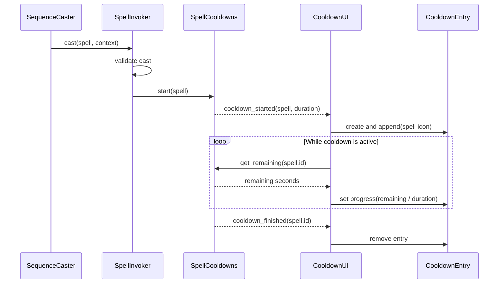

# Feature Overview

Add a cooldown display to the player HUD so the player can see which spells are temporarily unavailable and how soon each one can be cast again.

When an accepted spell cast starts a cooldown, the HUD adds one entry below the health bar. The entry displays a single representative icon for the spell with a translucent gray overlay covering it. The overlay shrinks vertically as the cooldown elapses. When the cooldown finishes, the entry is removed and the remaining entries reflow to close the gap.

The initial spell icons may reuse the X, Y, and B button artwork. This is temporary presentation data: the cooldown UI must not infer an icon from a spell's input sequence. A future spell-group system may replace these icons without changing the cooldown tracking or UI lifecycle.

## Behavior Rules

- Only accepted spell casts with a cooldown greater than zero create cooldown entries.
- A rejected cast, including an attempt to cast a spell that is already cooling down, must not create or restart an entry.
- Each active spell cooldown is represented by exactly one entry.
- An entry displays one representative icon even when the spell's casting sequence contains several inputs.
- The representative icon comes from spell metadata rather than being derived by the UI from the casting sequence.
- The gray overlay is fully visible when the cooldown begins and decreases continuously until no overlay remains.
- The overlay decreases vertically, revealing the icon from top to bottom.
- Entries appear from left to right in the order their cooldowns started.
- Finishing a cooldown removes its entry. Later entries retain their relative order and shift to close the empty space.
- The UI supports several different spell cooldowns running at the same time.
- When no spell is cooling down, the cooldown container is empty and does not reserve unnecessary HUD space.
- Cooldown progress shown by the HUD must use `SpellCooldowns` as its source of truth. The UI must not run an independent gameplay cooldown timer.

# Implementation Details

## Scene Composition

The cooldown display belongs to the existing screen-space `PlayerHud`, directly below its health bar.

```text
PlayerHud (Control)
├── HealthMarginContainer
│   └── ...
│       └── HealthBar
└── CooldownUI (Control)
    └── CooldownContainer (HBoxContainer)
        ├── CooldownEntry
        ├── CooldownEntry
        └── ...
```

`CooldownEntry` is a small composed UI scene rather than cooldown logic embedded in `PlayerHud`. An entry can be structured approximately as follows:

```text
CooldownEntry (Control)
├── SpellIcon (TextureRect)
└── CooldownOverlay (ColorRect or TextureProgressBar)
```

| Component | Responsibility |
|-----------|----------------|
| `SpellDefinition` | Provide the spell ID, cooldown duration, and temporary representative icon metadata. |
| `SpellCooldowns` | Own authoritative runtime cooldown state, report spell availability and remaining time, and emit lifecycle signals. |
| `SpellInvoker` | Start a cooldown only after a cast passes validation and is accepted. |
| `PlayerHud` | Compose the health and cooldown displays and provide their dependencies. |
| `CooldownUI` | Listen for cooldown lifecycle events, preserve casting order, create entries, and remove completed entries. |
| `CooldownEntry` | Render one spell icon and update its vertical gray overlay from a normalized progress value. |

## Spell Icon Metadata

Add an exported representative icon to `SpellDefinition`, for example:

```gdscript
@export var icon: Texture2D
```

For the initial spells:

- Magic Arrow may use the X button icon.
- Push may use the Y button icon.
- Dash may use the B button icon.

This mapping is configured in each spell resource. `CooldownUI` and `CooldownEntry` must treat the texture as opaque presentation data and must not inspect `SpellDefinition.sequence` to choose it. This keeps the UI compatible with multi-input spells and allows the future spell-group system to provide different artwork.

If an accepted spell has no assigned icon, the cooldown remains authoritative and still completes normally. The UI should emit a warning and use a simple fallback texture or placeholder entry rather than failing the cast.

## Cooldown Lifecycle

The display must subscribe to `SpellCooldowns`, not `SequenceCaster.spell_selected`. `spell_selected` can occur before `SpellInvoker` rejects a cast, while `SpellCooldowns.cooldown_started` represents a cooldown that actually began.

The lifecycle is:



The `cooldown_started` signal should provide enough metadata for the UI to create an entry without maintaining a second copy of the spell registry. Passing the `SpellDefinition` and duration is acceptable. `cooldown_finished` may continue to identify the entry by spell ID.

`CooldownUI` should keep a dictionary from spell ID to entry for direct updates and removal, plus rely on the `HBoxContainer` child order for visual casting order. Since a spell cannot be accepted again while its cooldown is active, duplicate entries for one spell ID should not occur. The UI should nevertheless guard against a duplicate start signal and update the existing entry instead of adding another.

## Progress Presentation

Cooldown progress is normalized as:

```text
remaining_ratio = clamp(remaining_seconds / cooldown_duration, 0.0, 1.0)
```

- At `1.0`, the translucent gray overlay covers the full icon.
- As the ratio approaches `0.0`, the overlay's height shrinks while remaining anchored to the bottom edge, revealing the icon from top to bottom.
- At `0.0`, `cooldown_finished` removes the complete entry.
- The icon itself remains visible beneath the overlay for the whole cooldown.
- The overlay must not intercept mouse input.

The first implementation does not require a numeric countdown, animation tween, shader, or radial sweep. Updating the overlay from the authoritative remaining time each frame is sufficient and avoids drift between presentation and gameplay state.

## Layout and Styling

- Place `CooldownUI` immediately below the health bar in the top-left player HUD.
- Use a horizontal container so active cooldown entries naturally follow casting order and reflow after removal.
- Match the existing pixel-art presentation, including nearest-neighbor texture filtering where applicable.
- Keep icon size, spacing, and overlay color/opacity configurable in the scene or theme so they can be tuned without changing cooldown logic.
- The icons must remain readable against the translucent gray overlay.
- The cooldown UI remains in the existing `PlayerHudLayer` and therefore stays fixed to the viewport rather than following the player's world position.

## Runtime and Failure Handling

- Connecting and disconnecting the HUD must not alter active cooldown state.
- Removing an entry is a presentation operation only; `SpellCooldowns` decides when the cooldown has finished.
- An unknown spell ID in a finish signal should be ignored safely.
- Invalid durations must not cause division by zero. A cooldown with a duration less than or equal to zero produces no entry.
- Entry nodes should be freed when their cooldown finishes so completed cooldowns do not leave stale controls or references.

# Out of Scope

- Final spell or spell-group artwork.
- Showing the complete casting sequence in a cooldown entry.
- Fixed slots for X, Y, B, or specific spells.
- Numeric countdown text.
- Radial cooldown wipes, shaders, particles, sound effects, or completion flashes.
- Dragging, sorting, or manually dismissing cooldown entries.
- Persisting cooldowns across scene reloads or saved games.
- Cooldown reduction modifiers, charges, shared cooldown groups, and global cooldowns.
- Changes to spell balance or cooldown duration values.

# Implementation Plan

1. Add exported representative icon metadata to `SpellDefinition` and assign the temporary X, Y, and B textures to the initial spell resources.
2. Adjust the `SpellCooldowns.cooldown_started` contract so the HUD receives the accepted spell metadata and cooldown duration.
3. Create a reusable `CooldownEntry` scene that renders one icon and a vertically shrinking translucent gray overlay.
4. Create `CooldownUI` to listen to `SpellCooldowns`, append entries in casting order, update their progress from authoritative remaining time, and remove them on completion.
5. Compose `CooldownUI` into `PlayerHud` below the health bar and assign the player's `SpellCooldowns` dependency.
6. Add focused tests for entry creation, progress normalization, ordering, duplicate protection, and removal.
7. Manually verify the layout and visual progression with one cooldown and with several overlapping cooldowns.

# Acceptance Criteria

1. Casting Magic Arrow successfully adds one cooldown entry below the health bar using its configured representative icon.
2. Casting Push or another zero-cooldown spell does not add an entry unless that spell is configured with a cooldown greater than zero.
3. The entry begins with its icon fully covered by a translucent gray overlay.
4. The overlay decreases vertically and continuously, revealing the icon from top to bottom as the authoritative cooldown elapses.
5. The entry disappears when the cooldown finishes.
6. Attempting to cast a spell while that spell is cooling down does not add or restart an entry.
7. Starting several different cooldowns displays one entry per spell from left to right in casting order.
8. When an earlier entry completes, it is removed and the remaining entries reflow without changing their relative order.
9. A multi-input spell still displays exactly one configured representative icon.
10. The UI does not derive its representative icon from the spell's input sequence.
11. Removing or updating a UI entry does not change whether the spell is ready to cast.
12. Missing icon metadata produces a warning and safe fallback presentation without interrupting spell execution or cooldown completion.
