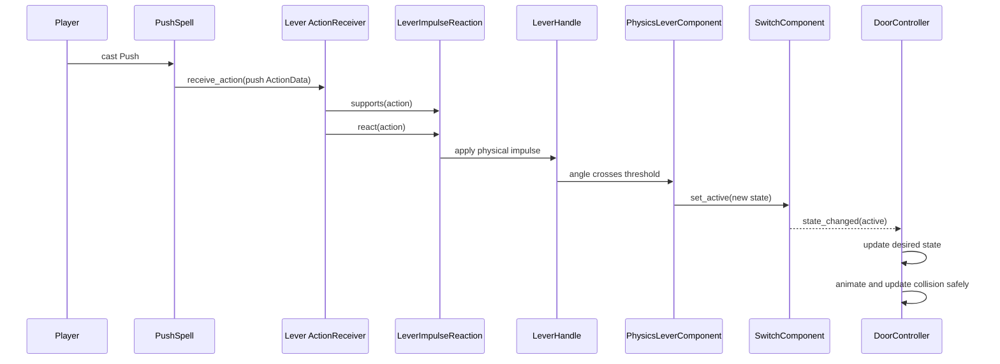
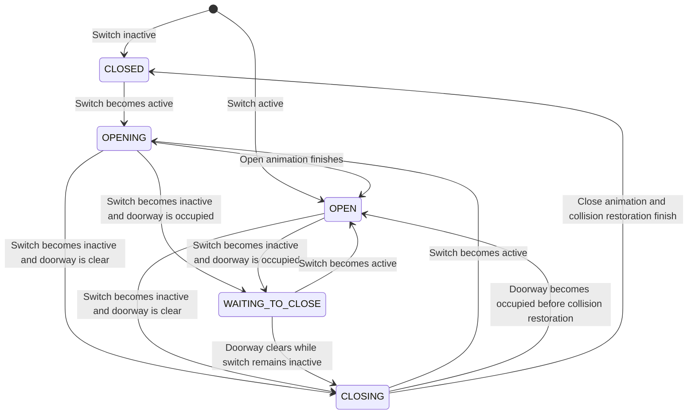

# Feature Overview

Implement physical levers that can be moved by the existing Push spell or sufficiently forceful physics objects, and doors that open or close in response to those levers. Ordinary player body contact is intentionally too weak to operate a lever.

The initial implementation consists of one reusable `Lever` scene and one reusable `Door` scene. A lever has a constrained `RigidBody2D` handle whose physical position drives generic switch state. A door observes the configured switch and updates its animation and collision without the lever directly calling door-specific methods.

This feature must use composition and the existing action-reaction pipeline. Push spells deliver `ActionData` to the lever's `ActionReceiver`, but the reaction only applies an impulse to the physical handle. Collisions from eligible bodies may move the same handle through normal physics. A composed physics component updates `SwitchComponent` only after the handle crosses a configured activation or deactivation threshold, and connected doors react to that state change.

## Behavior Rules

### Lever

- A lever begins in an editor-configurable active or inactive state.
- The lever handle begins at the physical stop corresponding to the initial switch state.
- An `ActionData` with `type = &"push"` applies an impulse to the lever handle; it does not change switch state directly.
- The impulse uses the action's direction and strength, so a Push cast is not guaranteed to activate the lever.
- The player may contact the handle physically, but the player's configured rigid-body push weight is too low to cross either lever threshold.
- Other eligible physics bodies can move the handle through collision when they transfer enough momentum.
- A body activates or deactivates the lever only if it moves the handle far enough to cross the corresponding angular threshold.
- Physical resistance, damping, mass, source momentum, and the distance to the threshold determine whether an applied impulse or collision is strong enough.
- Unsupported action types are ignored safely through the existing `ActionReceiver` behavior.
- A normal lever becomes active when the handle crosses the active threshold and inactive when it crosses the inactive threshold.
- Separate active and inactive thresholds provide hysteresis so jitter near the center does not repeatedly change state.
- After a normal lever crosses a threshold, it settles against the corresponding physical stop.
- A one-shot lever may transition from inactive to active only once. After activation it latches at the active stop and ignores impulses or collisions that would deactivate it.
- Changing the lever state emits `state_changed(active)` exactly once when the value actually changes.
- Reapplying the current state does not emit another state-change signal.
- The handle pose and lever presentation always reflect the authoritative switch state after the physics settles, including the initial state.
- Resting contact, weak impacts, and motion that does not cross a threshold must not change switch state.

### Door

- A door begins synchronized with its configured switch.
- An active switch means the door's desired state is open; an inactive switch means its desired state is closed.
- Opening plays the open animation and makes the doorway traversable at the animation's configured collision-release moment.
- Closing plays the close animation and makes the doorway solid at the animation's configured collision-restore moment.
- Receiving the state already desired does not restart the current animation.
- A door must reverse or update its pending transition when the lever changes state during an animation.
- A door must never restore solid collision while a valid physics body occupies its doorway.
- If closing is requested while the doorway is occupied, the door remains open and keeps the close request pending.
- When the doorway becomes clear, a pending close begins automatically if the switch is still inactive.
- If the doorway becomes occupied during closing before collision is restored, the door returns to or remains in its safe open state and retries only after the doorway is clear.
- Opening and closing one door must not change switch state or directly change another door.
- Several doors may observe the same switch and respond independently.

# Implementation Details

## Scene Composition

The initial lever should be composed approximately as follows:

```text
Lever (Node2D)
├── Base (StaticBody2D)
├── LeverHandle (RigidBody2D, group: character_pushable)
│   ├── Sprite2D or Polygon2D
│   ├── CollisionShape2D
│   └── ActionReceiver (Area2D)
│       ├── CollisionShape2D
│       └── LeverImpulseReaction
├── PivotJoint (PinJoint2D)
├── SwitchComponent
└── PhysicsLeverComponent
```

The initial door should be composed approximately as follows:

```text
Door (Node2D)
├── Sprite2D or AnimatedSprite2D
├── AnimationPlayer
├── DoorBody (AnimatableBody2D)
│   └── CollisionShape2D
├── DoorwayDetector (Area2D)
│   └── CollisionShape2D
└── DoorController
```

An `AnimatableBody2D` is preferred for a door whose physical body moves with its animation. If the initial presentation only hides or replaces a stationary blocker, the body may remain stationary and only its collision shape needs to be enabled or disabled.

| Component | Responsibility |
|-----------|----------------|
| `ActionReceiver` | Receive `ActionData` from action spells and route it to compatible reactions. |
| `LeverImpulseReaction` | Accept Push actions and apply a directional impulse or torque impulse to the physical handle. It does not change switch state. |
| `LeverHandle` | Provide the physical collision, mass, angular velocity, and visible handle pose. |
| `PivotJoint` | Keep the handle attached to its base while allowing it to rotate. |
| `PhysicsLeverComponent` | Apply resistance and limits, detect threshold crossings, settle the handle at stable stops, and update the switch. |
| `SwitchComponent` | Own active/inactive state, toggle and one-shot rules, and the `state_changed` signal. It does not know what consumes its state. |
| `Lever` presentation | Display the physical handle and optional state feedback. It does not decide activation. |
| `DoorController` | Observe a configured switch, own the door transition state, coordinate animation, and request collision changes. |
| `DoorBody` | Provide the solid physics collision that blocks the doorway while closed. |
| `DoorwayDetector` | Report bodies occupying the doorway so collision is not restored on top of them. |
| `AnimationPlayer` | Animate the door, invoke its collision-timing callbacks, and optionally provide non-physical lever feedback. |

## SwitchComponent

`SwitchComponent` is a generic state producer rather than a lever-specific controller. Its initial contract should remain small:

```gdscript
class_name SwitchComponent
extends Node

signal state_changed(active: bool)

@export var active: bool = false
@export var one_shot: bool = false

func toggle() -> void
func set_active(value: bool) -> void
```

The following rules apply:

- `toggle()` changes `active` from false to true or true to false.
- When `one_shot` is enabled and `active` is already true, `toggle()` does nothing.
- `set_active()` changes state only when the requested value differs from the current value.
- `state_changed` is emitted after the authoritative value changes.
- Consumers read the current `active` value during initialization and then subscribe to changes.
- The component must not contain animation, collision, spell, door, or scene-path logic.

The one-shot option supports permanent puzzle levers without requiring a `PermanentLever` subclass. When the physical lever activates a one-shot switch, `PhysicsLeverComponent` also latches the handle at the active stop so physical pose and authoritative state cannot disagree. More complex switch modes should be introduced only when a concrete puzzle requires them.

## Physical Lever Handle

`LeverHandle` is a `RigidBody2D` attached to a static base through `PinJoint2D`. Its collision shape extends away from the pivot so impulses and physical contact create angular motion.

The initial physics rules are:

- The handle uses the Entities physics layer and collides with World and Entities.
- The handle belongs to the existing `character_pushable` group so `CharacterRigidBodyPushComponent` can push it.
- `CharacterRigidBodyPushComponent` applies its impulse at the collision point rather than only at the target body's center, but the Player scene uses a low impulse factor and cap so contact cannot operate the lever. Ordinary rigid bodies may still translate and rotate naturally when pushed.
- Pushable bottles use low ground friction so the reduced player contact impulse can still move them without weakening the lever's detent resistance.
- Other `RigidBody2D` objects, including the existing pushable bottles, transfer momentum through normal collisions when their masks permit it.
- Gravity on the handle is disabled unless required by the final lever orientation.
- Linear movement away from the pivot is constrained by the joint. Any remaining positional drift is corrected by the handle's low-level physics integration.
- Rotation is clamped between configurable inactive and active stop angles.
- For a lever whose active direction uses increasing local angle, configuration must satisfy `inactive_stop <= inactive_threshold < active_threshold <= active_stop`. A mirrored lever may invert the comparison through an exported direction setting rather than duplicating the scene.
- Angular damping and configurable detent resistance prevent weak contact from gradually toggling the lever unintentionally.
- After crossing a threshold, the handle is driven toward the corresponding stable stop.

Godot's joint is responsible for the pivot constraint. If additional angle limiting or drift correction is needed, a thin script on `LeverHandle` forwards `_integrate_forces(state)` to the composed `PhysicsLeverComponent`; the state machine and tuning rules remain in the component rather than in the scene root.

## Lever Push Reaction

`LeverImpulseReaction` extends the existing `ActionReaction`:

```gdscript
class_name LeverImpulseReaction
extends ActionReaction

@export var handle: RigidBody2D
@export var physics_component: PhysicsLeverComponent
@export var impulse_multiplier: float = 1.0
@export var application_offset: Vector2

func supports(action: ActionData) -> bool:
    return action != null and action.type == &"push"

func react(action: ActionData) -> void:
    var impulse := action.direction.normalized() * action.strength * impulse_multiplier
    var lever_arm := application_offset.rotated(handle.global_rotation)
    physics_component.queue_torque_impulse(lever_arm.cross(impulse))
```

- The reaction receives the physical handle and its composed physics component through exported references.
- It accepts only Push actions in the initial implementation.
- It uses the action's direction and strength rather than treating every Push as a successful activation.
- The application offset must be away from the pivot so the impulse produces useful torque.
- Spell torque is queued on `PhysicsLeverComponent` and converted through the rigid body's inverse inertia during `_integrate_forces()`. This prevents the joint solver from discarding the first impulse while preserving inertial motion and the configured speed cap.
- It must not locate the switch or door through a fixed path outside its composed scene.
- It must not call `SwitchComponent`, call `DoorController`, manipulate door collision, or force the handle to a final angle.
- The existing `ActionSpell` deduplication ensures one Push cast dispatches at most one action to a particular `ActionReceiver`.
- The lever's `ActionReceiver` uses the existing Action Receivers collision layer so the Push spell's `ShapeCast2D` can discover it.
- Receiving one Push action applies at most one impulse, but that impulse changes switch state only if the resulting motion crosses a threshold.



Physical collision follows the same path after the impulse is produced: the colliding body moves `LeverHandle`, then `PhysicsLeverComponent` observes the resulting angle. A colliding body never needs to know about `SwitchComponent` or `DoorController`.

## PhysicsLeverComponent

`PhysicsLeverComponent` receives exported references to `LeverHandle` and `SwitchComponent`. It owns the translation between continuous physical motion and discrete switch state.

Its responsibilities are:

- Place the handle at the correct stop during initialization without emitting an unnecessary state change.
- Clamp the handle to its configured minimum and maximum angles.
- Apply angular damping and detent or settling torque during physics integration.
- Change the switch to active only after the active threshold is crossed.
- Change a normal switch to inactive only after the separate inactive threshold is crossed.
- Use threshold hysteresis and idempotent `set_active()` calls to prevent repeated signals from bounce or jitter.
- Latch a one-shot handle at its active stop after successful activation.
- Avoid reading collision partners or deciding behavior from body names or level paths.

The switch remains the discrete authoritative state consumed by doors. The handle angle is the physical input used to request changes to that state.

## Lever Presentation

- The physical handle rotation is the primary lever animation; a separate `AnimationPlayer` is not required to animate activation.
- Optional color, sound, particles, or base animation may listen to `SwitchComponent.state_changed` without controlling physics or state.
- Initialization must place the handle at the stop matching the configured switch state so it does not briefly show the opposite pose.
- Presentation failure must not prevent the switch signal from reaching a door.
- Final artwork, sound, particles, and elaborate activation feedback are outside the initial implementation.

## DoorController

`DoorController` should use a small explicit transition state, for example:

```gdscript
enum State {
    CLOSED,
    OPENING,
    OPEN,
    WAITING_TO_CLOSE,
    CLOSING,
}
```

It receives exported references to the generic switch, animation player, door collision shape or body, and doorway detector. It must not search the level tree for a node named `Lever`.

On `_ready()`, the controller must:

1. Validate its required composed references.
2. Connect to `switch.state_changed`.
3. Initialize its desired state from `switch.active`.
4. Apply the matching door pose and collision immediately without playing a startup transition.

The transition behavior is:



`DoorController` owns the desired and transition state, while `SwitchComponent.active` remains the source of truth for whether the door should ultimately be open or closed.

## Door Animation and Collision Timing

- Door collision starts enabled in the closed state and disabled in the open state.
- `DoorBody` uses the World collision layer so characters and other world-colliding bodies are blocked consistently.
- Collision changes must use `set_deferred(&"disabled", value)` because physics state must not be changed during a physics query callback.
- Animation method tracks should call small controller methods such as `release_collision()` and `try_restore_collision()` at visually appropriate frames.
- `release_collision()` disables the door collision once the opening has created enough clearance.
- `try_restore_collision()` first checks `DoorwayDetector`. It enables collision only when the doorway is clear and the desired state is still closed.
- A close animation must not finish in a visually closed pose with collision disabled indefinitely. If collision cannot be restored safely, the controller returns the door to its open pose and waits to retry.
- The detector remains active whether the door body collision is enabled or disabled.
- Bodies are considered obstructions when they match the detector's collision mask. The initial mask should include the Entities layer so both the player and mobs are protected.
- Areas, projectiles, and spell commands do not block a door from closing in the MVP.

When possible, collision should be disabled only after the visual door has moved clear and restored only when the visual door has returned to its blocking position. The exact animation frames are presentation data and remain configurable in the scene.

## Connecting Levers and Doors

Each placed `Door` exposes a `SwitchComponent` reference on its `DoorController`. In the level scene, assign that reference to the `SwitchComponent` belonging to the intended placed lever.

```text
LevelRoot
├── Lever
│   └── SwitchComponent ◄─────────────┐
├── DoorA                             │
│   └── DoorController.switch ────────┘
└── DoorB
    └── DoorController.switch ────────┘
```

This direct editor wiring is the initial solution because it is explicit and easy to inspect:

- One lever can control several doors by assigning the same switch to each controller.
- A door can be reassigned without changing lever code.
- Lever and door scenes remain reusable.
- No global event bus, group-name lookup, or hard-coded absolute scene path is required.

A shared activation-channel resource or puzzle coordinator may be introduced later for many-to-many logic, dynamically spawned rooms, or combinations such as "all switches must be active." It is not required for the initial lever-to-door relationship.

## Failure Handling

- A lever with a missing handle, switch, joint, or physics-component reference should report a clear configuration error and remain safe.
- A `LeverImpulseReaction` with a missing handle must ignore the action safely rather than changing switch state.
- A door with a missing switch, animation, collision, or detector reference should report a clear configuration error rather than searching arbitrary nodes.
- An invalid or null `ActionData` must not apply an impulse or change switch state.
- A zero-strength Push, resting contact, or insufficient physical motion must not activate the lever.
- Physics jitter around the center must not emit repeated switch changes.
- A one-shot lever must not display an inactive pose after it has latched active.
- Freeing a lever or door must not leave callbacks that attempt to access invalid instances.
- Repeated signals carrying the current state must be idempotent.
- An obstructed close request remains pending only while the switch still requests the closed state.

## Initial Configurable Values

The following values or references should be configurable in the editor:

- Lever initial active state.
- Lever one-shot behavior.
- Handle mass and physics material.
- Inactive and active physical stop angles.
- Separate inactive and active threshold angles.
- Angular damping, detent resistance, and settling strength.
- Push impulse multiplier and application offset or torque multiplier.
- Player contact-push impulse factor and maximum impulse; these must remain below the lever's activation requirement.
- Push spell strength; this must remain high enough to cross a lever threshold when cast from the correct direction.
- Handle physics layer, collision mask, and pushable group.
- Optional lever state-feedback visuals.
- Supported action type, if generalized beyond the initial Push-only reaction.
- Door switch reference.
- Door open, close, opened, and closed animation names or tracks.
- Door collision shape or body reference.
- Doorway detector reference and collision mask.
- Collision-release and collision-restore timing through animation method tracks.

The initial force tuning is:

- Player `CharacterRigidBodyPushComponent.impulse_factor`: `0.1`.
- Player `CharacterRigidBodyPushComponent.maximum_impulse`: `1.0`.
- Push spell strength: `200.0`.
- Lever Push impulse multiplier: `4.0`.
- Lever maximum angular speed: `24.0` radians per second.
- Bottle physics-material friction: `0.03`.

These values preserve a large separation between ordinary player contact and a deliberate Push cast. They may be retuned together, but the acceptance behavior must remain unchanged.

# Out of Scope

- Levers activated by a direct interaction button, damage, or non-physical event.
- Projectiles that do not already participate in compatible rigid-body collision or Push actions.
- Per-body allowlists beyond normal physics layers, masks, and the existing pushable conventions.
- Displaying impact strength or a force meter to the player.
- Physically simulated cables, gears, counterweights, or breakable lever mechanisms.
- Timed switches or doors that close automatically after a delay.
- Keys, locks, inventory requirements, or access permissions.
- Multi-switch AND, OR, XOR, sequence, or combination puzzle logic.
- A global signal bus or shared activation-channel framework.
- Saving lever and door state across scene reloads or saved games.
- Network synchronization.
- Crushing or damaging entities with closing doors.
- Breakable, jammed, locked, or destructible doors.
- Final artwork, audio, particles, camera effects, and final level design.

# Implementation Plan

1. Implement and independently test `SwitchComponent`, including initial state, idempotent assignment, toggle behavior, and one-shot behavior.
2. Create the constrained `LeverHandle` using `RigidBody2D`, a static base, `PinJoint2D`, and collision settings compatible with the player and existing pushable objects.
3. Implement `PhysicsLeverComponent` with angle limits, active/inactive thresholds, hysteresis, resistance, settling, initial pose synchronization, and one-shot latching.
4. Implement `LeverImpulseReaction` as a Push-compatible `ActionReaction` that applies an impulse or torque impulse to the handle without directly changing the switch.
5. Create the `Lever` scene with its handle, joint, switch, physics component, `ActionReceiver`, reaction, and presentation.
6. Verify that Push finds the lever through the Action Receivers collision layer and that direction and strength produce physical motion.
7. Verify that player body contact cannot cross a threshold, while existing pushable rigid bodies with enough momentum can move the handle and weak collisions cannot activate it.
8. Implement `DoorController` with explicit closed, opening, open, waiting-to-close, and closing states.
9. Create the `Door` scene with its animated presentation, physics body, collision shape, doorway detector, and controller.
10. Add animation method tracks for collision release and safe collision restoration.
11. Connect one placed door to one placed lever through the exported switch reference and verify startup synchronization.
12. Test reversing the physical lever during door opening and closing.
13. Test an occupied doorway, delayed closing, automatic retry after exit, and reactivation while waiting.
14. Connect a second door to the same lever and verify that both doors respond independently.
15. Add a small playable lever-and-door arrangement to the level and tune physics resistance, thresholds, collision, and animation timing.

# Acceptance Criteria

1. Casting Push on the lever applies one directional physical impulse and does not directly change switch state.
2. A Push strong enough to move the handle across the active threshold activates the switch.
3. A weak or incorrectly directed Push that does not cross a threshold leaves switch state unchanged.
4. The player cannot activate the lever through ordinary body collision, even at maximum movement speed.
5. An eligible moving rigid body can activate the lever through collision when it transfers enough momentum.
6. Resting contact and weak impacts do not activate the lever.
7. The handle remains attached to its pivot and stays within its configured angular stops.
8. The handle settles at the stop corresponding to the switch state without repeatedly emitting changes from jitter.
9. Moving a normal active lever across the inactive threshold requests that the door close.
10. A one-shot lever activates once, latches at its active stop, and cannot be physically deactivated.
11. Unsupported actions do not apply an impulse or change switch state.
12. The connected closed door begins opening when the switch becomes active.
13. The door becomes traversable at the configured point in its opening animation.
14. The door restores solid collision only at the configured point in its closing animation.
15. Assigning the current switch value again does not emit a duplicate state change or restart a door animation.
16. A door initializes open with disabled collision when its switch begins active.
17. A door initializes closed with enabled collision when its switch begins inactive.
18. A close request is delayed while the player or a mob occupies the doorway.
19. A delayed close begins automatically after the doorway clears if the switch remains inactive.
20. Reactivating the switch while a close is pending cancels that pending close.
21. A body entering during closing is not trapped by newly restored door collision.
22. Changing the lever during a door transition produces the newly requested final state without leaving animation or collision inconsistent.
23. Two doors connected to one lever both respond while retaining independent transition state.
24. The lever does not reference a concrete door or fixed level path.
25. The door does not depend on the player, Push spell, rigid-body handle, or concrete lever script.
26. Missing required references produce clear errors and do not crash the game.
