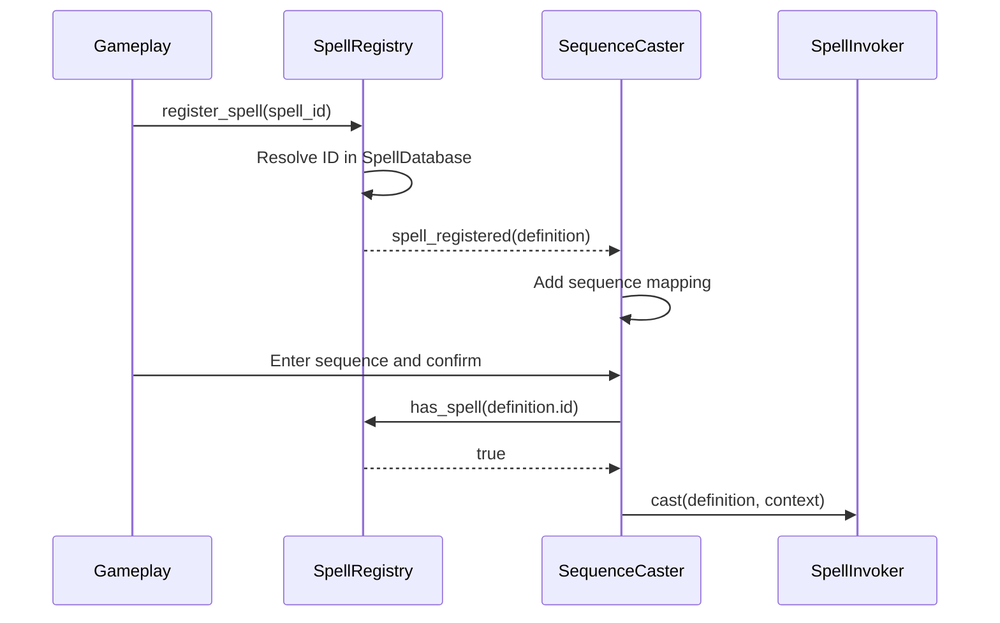

# Feature Overview

Replace the static list of spells configured directly on `SequenceCaster` with a player-owned `SpellRegistry`. The registry is the authoritative source for which spells the player can currently cast and supports adding or removing spells during gameplay.

The game also needs a `SpellDatabase` containing every spell known to the game. The initial implementation uses this database for development and debugging, but it should also be suitable for future systems such as spell rewards, shops, progression, and save data.

For clarity, this specification uses the following terms:

- A **catalogued spell** is a `SpellDefinition` contained in the game-wide `SpellDatabase`.
- A **registered spell** is a catalogued spell currently present in a particular player's `SpellRegistry`.
- A spell is **available to the player** only when it is registered. Being present in the database does not make it castable.

The initial implementation adds a temporary **Spell Registry** button to the ESC pause menu. The button opens a separate centered debug window showing all catalogued spells alongside the player's registered spells. This allows the registry to be inspected and changed at runtime without becoming the final spell-selection interface.

## Goals

- Maintain one game-wide collection of all `SpellDefinition` resources.
- Give each player an independent, mutable collection of registered spells.
- Make `SpellRegistry` the source of truth for player spell availability.
- Keep `SequenceCaster` focused on input buffering and sequence resolution.
- Allow gameplay and debug tools to register and unregister spells through a small public API.
- Update casting and temporary UI immediately when the registry changes.

## Non-Goals

- A final spellbook, loadout, inventory, reward, or shop interface.
- Unlock requirements, spell costs, progression rules, or maximum registry capacity.
- Persisting registered spells in save data.
- Changing spell cooldown behavior or cancelling an already accepted cast.
- Supporting different spells with the same input sequence for one player.

# Behavior Rules

- The `SpellDatabase` contains all spells that may be registered in the initial game build.
- Each catalogued spell must have a non-empty, unique `SpellDefinition.id`.
- Input sequences must be unique among catalogued spells for the initial implementation.
- A registry may contain only spells present in its configured database.
- A spell is registered at most once per registry. Re-registering it is an idempotent no-op.
- Unregistering a spell that is not registered is an idempotent no-op.
- Registry mutations use spell IDs at their public boundary. The registry resolves and exposes the canonical `SpellDefinition` from the database.
- Registering or unregistering a spell updates sequence resolution without recreating the player or `SequenceCaster`.
- Once a spell is unregistered, confirming its sequence fails as an unknown sequence and does not call `SpellInvoker`.
- Registering a spell makes its sequence castable immediately.
- Unregistering a spell does not cancel a spell command that has already been accepted and started.
- Unregistering a spell does not clear its active cooldown. If the same spell is registered again before that cooldown finishes, the existing cooldown still applies.
- Registry state belongs to a player instance. Mutating one player's registry must not affect another player's registry or the shared database.
- Opening the ESC pause menu shows the normal compact menu; the registry debug window remains hidden until its button is pressed.
- The registry window can be closed with its Back button or ESC, returning to the compact pause menu without resuming gameplay.

# Implementation Details

## Scene and Resource Composition

The database is shared definition data, while the registry is runtime state composed into the player:

```text
SpellDatabase.tres (SpellDatabase resource)
└── SpellDefinition[]

Player (CharacterBody2D)
├── SpellRegistry (Node)
├── SequenceCaster (Node)
├── SpellCooldowns (Node)
└── SpellInvoker (Node)
```

The temporary displays belong inside a separate centered window opened from the ESC pause menu. `Main` supplies the active player's registry to `PauseMenu`, which passes it to the debug UI. The UI must not search for the player through a fixed scene-tree path.

```text
PauseMenu (Control)
├── PanelContainer (compact pause menu)
│   └── MenuButtons
│       ├── Resume
│       ├── SpellRegistryButton
│       ├── Restart
│       └── Quit
└── SpellRegistryWindow (centered, hidden initially)
    └── VBoxContainer
        ├── SpellRegistryDebugUI (Control)
        │   ├── CataloguedSpells (Control)
        │   │   └── SpellList (Container)
        │   └── RegisteredSpells (Control)
        │       └── SpellList (Container)
        └── Back
```

| Component | Responsibility |
|-----------|----------------|
| `SpellDefinition` | Store immutable spell metadata and the command scene used to cast the spell. |
| `SpellDatabase` | Own the game-wide collection and resolve canonical spell definitions by ID. It has no player state. |
| `SpellRegistry` | Own one player's registered spell IDs, answer availability queries, and emit changes. |
| `SequenceCaster` | Buffer input and resolve sequences using only the spells exposed by its registry. |
| `SpellInvoker` | Validate and execute a spell that has already been resolved. It does not decide which spells a player owns. |
| `SpellRegistryDebugUI` | Display database and registry contents in the centered registry window and call the registry API for temporary add/remove controls. |

## SpellDatabase

`SpellDatabase` is a `Resource` so its contents can be configured once in the editor and shared without introducing mutable global state.

Its initial contract should be approximately:

```gdscript
class_name SpellDatabase
extends Resource

@export var spells: Array[SpellDefinition] = []

func get_spell(spell_id: StringName) -> SpellDefinition
func has_spell(spell_id: StringName) -> bool
func get_spells() -> Array[SpellDefinition]
```

The database builds an ID lookup from the exported array. Callers must use its query methods instead of maintaining another game-wide spell list.

The database validates its definitions when the lookup is built:

- Null entries are invalid and are skipped with a clear error.
- An empty spell ID is invalid.
- Duplicate IDs are invalid because IDs identify spells in registry, cooldown, and future save data.
- An empty input sequence is invalid for a castable spell.
- Duplicate input sequences are invalid in this initial implementation.

Invalid entries must not silently replace valid entries in a lookup. The first valid definition remains addressable and each conflict produces an error that identifies both resources where possible.

`get_spells()` should not expose an array that callers can mutate to change the database accidentally. It may return a typed duplicate of the configured list.

## SpellRegistry

`SpellRegistry` is a runtime component tied to one player. It references a `SpellDatabase` and is initialized with an exported list of spell IDs so the player's starting spells remain configurable in the Player scene.

Its public contract should be approximately:

```gdscript
class_name SpellRegistry
extends Node

signal spell_registered(spell: SpellDefinition)
signal spell_unregistered(spell: SpellDefinition)

@export var database: SpellDatabase
@export var initial_spell_ids: Array[StringName] = []

func register_spell(spell_id: StringName) -> bool
func unregister_spell(spell_id: StringName) -> bool
func has_spell(spell_id: StringName) -> bool
func get_spell(spell_id: StringName) -> SpellDefinition
func get_registered_spells() -> Array[SpellDefinition]
```

The Boolean returned by each mutation reports whether registry state changed. Registering an already registered ID and unregistering an absent ID return `false` without emitting a signal.

Additional rules apply:

- `register_spell()` rejects an empty or unknown ID, reports a clear warning, returns `false`, and emits no signal.
- Successful registration stores the ID, resolves the canonical definition through `SpellDatabase`, and emits `spell_registered` after state changes.
- Successful unregistration captures the canonical definition, removes its ID, and emits `spell_unregistered` after state changes.
- `get_spell()` returns a definition only when that spell is registered; it does not expose arbitrary database entries.
- `get_registered_spells()` returns definitions in registration order and returns a copy that callers cannot use to mutate registry state.
- Starting spell IDs are applied in their configured order during initialization. Invalid and duplicate starting IDs follow the same rules as runtime registration.
- Initial population is complete before dependent components build their first lookup. It does not need to emit gameplay-facing registration signals during scene startup.

Gameplay systems that award or remove spells call the registry API. They must not edit `initial_spell_ids`, mutate an internal array, or modify the shared database at runtime.

## SequenceCaster Integration

Remove `SequenceCaster.available_spells`. Instead, give `SequenceCaster` an exported `SpellRegistry` reference.

At startup, `SequenceCaster` builds its `sequence_to_spell` lookup from `registry.get_registered_spells()`. It then listens to `spell_registered` and `spell_unregistered` and updates the lookup whenever availability changes.



The sequence lookup is an index derived from the registry, not an independent source of availability. `confirm_sequence()` must verify that the resolved spell is still registered before selecting or invoking it. This guards against stale state if a registry mutation and confirmation occur in the same frame.

When a spell is unregistered, `SequenceCaster` removes only the mapping that points to that definition. The current input buffer does not need to be cleared; confirmation uses the updated registry state. A sequence entered before unregistration therefore fails normally if it is confirmed afterward.

If the registry dependency is missing, `SequenceCaster` must report a clear configuration error and expose no castable spells. It must not fall back to a hidden local list.

## Temporary Debug UI

The initial UI is a development aid opened through a **Spell Registry** button in the ESC pause menu. Pressing ESC first shows the normal compact pause menu. Pressing the new button hides that menu and opens a separate centered window containing two live lists:

- **Catalogued Spells** shows every valid definition in `SpellDatabase`.
- **Registered Spells** shows only definitions currently registered for the player.

Each row should display at least the spell's `display_name`, ID, and input sequence. A catalogued row provides a temporary **Register** action, disabled while the spell is already registered. A registered row provides an **Unregister** action.

Both actions call `SpellRegistry.register_spell()` or `SpellRegistry.unregister_spell()`. The UI must not mutate its own copy of registry data. It subscribes to the registry signals and refreshes the affected rows after successful changes, ensuring changes made by non-UI gameplay systems also appear immediately.

The registry window provides a **Back** action that closes it and restores the compact pause menu. Pressing ESC while this window is open performs the same navigation instead of resuming gameplay. Resume, Restart, and Quit remain in the compact menu. The UI must handle missing icons or descriptions with text-only fallback presentation. Final artwork, controller navigation, animation, localization, and production styling are outside this feature.

## Runtime and Failure Handling

- A missing database is a configuration error. The registry remains empty and mutations fail safely.
- A missing registry on `SequenceCaster` is a configuration error. Input may still be buffered, but no spell may be resolved or invoked.
- Invalid database entries and starting IDs are reported during initialization and skipped without crashing the player scene.
- Registry signals describe completed state changes. Consumers can safely query the registry from within a signal callback and observe the new state.
- UI setup failure must not prevent registry mutation or casting.
- The database and `SpellDefinition` resources are treated as read-only at runtime. Per-player state exists only in `SpellRegistry`.

# Implementation Plan

1. Create `SpellDatabase` and a resource containing the existing Magic Arrow, Push, and Dash definitions.
2. Create the player-composed `SpellRegistry`, including its query and mutation API, initialization rules, and signals.
3. Add the registry to the Player scene and configure the three existing spells as its starting spell IDs.
4. Replace `SequenceCaster.available_spells` with a registry dependency and update sequence lookup when registry signals fire.
5. Add a Spell Registry button to the compact ESC menu and open the temporary catalogued-spells and registered-spells controls in a separate centered window.
6. Add focused automated tests for the database, registry, dynamic casting behavior, and UI synchronization.
7. Confirm the existing three spells still cast and respect cooldowns when registered.

# Testing

Automated tests should cover at least:

- Database lookup returns the canonical definition for a known ID and no definition for an unknown ID.
- Null definitions, empty IDs, duplicate IDs, empty sequences, and duplicate sequences are rejected without silently replacing valid entries.
- Starting spell IDs populate the registry in the configured order.
- Registering a known spell changes availability and emits exactly one `spell_registered` signal.
- Registering an existing spell is a no-op.
- Registering an unknown spell is rejected.
- Unregistering a registered spell changes availability and emits exactly one `spell_unregistered` signal.
- Unregistering an absent spell is a no-op.
- Returned arrays cannot be mutated to alter database or registry state.
- Two registries using the same database maintain independent state.
- `SequenceCaster` can resolve a spell immediately after registration and cannot resolve it immediately after unregistration.
- Unregistering a spell after its command starts does not cancel the command.
- Unregistering and re-registering a cooling-down spell does not bypass its cooldown.
- Both temporary UI lists reflect registry mutations initiated through either the UI or another gameplay system.
- The registry UI is absent from the normal player HUD, remains hidden when the compact ESC menu first opens, and appears centered after pressing its menu button.
- The registry window's Back action and ESC both return to the compact pause menu without resuming gameplay.

# Acceptance Criteria

- The Player scene no longer configures a spell array directly on `SequenceCaster`.
- All existing spell definitions are present in one `SpellDatabase` resource.
- The Player owns a `SpellRegistry` initialized with the existing castable spells.
- Registering and unregistering spells at runtime changes which sequences the player can cast without reloading the scene.
- Only definitions registered in the player's registry can reach `SpellInvoker` through sequence casting.
- The catalogued and registered spell displays remain synchronized with the database and registry.
- The compact ESC menu contains a Spell Registry button that opens a separate centered registry debug window.
- Closing the registry window returns to the compact pause menu, where the existing Resume, Restart, and Quit actions remain available.
- Existing cooldown behavior continues to work and cannot be reset by removing and re-adding a spell.
