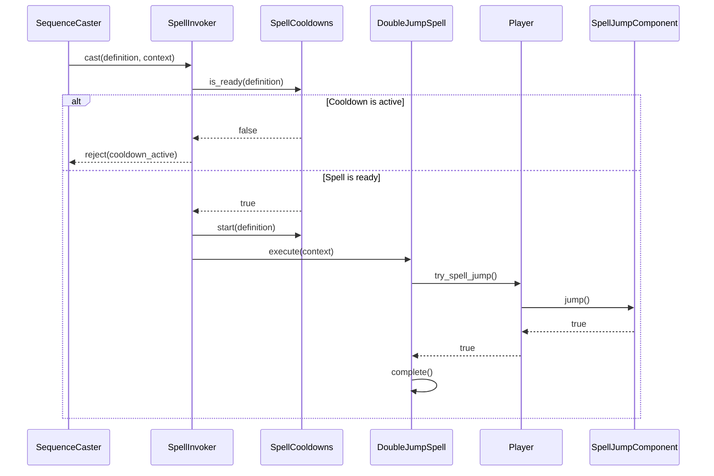

# Feature Overview

Add a **Double Jump** movement spell that applies an upward jump impulse whenever it is successfully cast. The spell works while the player is standing on the floor or airborne, regardless of how the player became airborne.

The spell uses the sequence **Circle, Triangle** followed by the normal cast-confirm input. These buttons map to the project's internal `[move, interaction]` tokens. The spell is catalogued in the shared `SpellDatabase` and registered to the player by default.

Double Jump uses a short time-based cooldown as its only repeat-use restriction. The player does not need to land, perform a normal jump, or reset an airborne charge before casting it again. Once the cooldown expires, the spell may be cast again immediately, including several times during one airborne period.

## Goals

- Add one simple, self-contained movement spell using the existing sequence-casting pipeline.
- Allow the spell to jump from the floor or redirect the player upward in midair.
- Allow repeated airborne casts whenever the cooldown expires.
- Use the existing `SpellCooldowns` as the only gameplay availability gate.
- Keep the vertical-impulse behavior in a composed movement component.
- Preserve the player's horizontal momentum when the spell succeeds.

## Non-Goals

- Requiring a normal jump before the spell can be used in midair.
- Limiting the spell to one or two uses per airborne period.
- Resetting or modifying availability when the player lands.
- Air-jump charges or an armed/consumed jump state.
- Mana costs, shared cooldown groups, or cooldown-reduction modifiers.
- Coyote time, jump buffering, or variable height for the spell jump.
- New animation, particles, sound, camera shake, or final icon artwork.
- Changing the behavior or balance of the player's normal jump.

# Behavior Rules

## Availability

- The spell can be cast when `SpellCooldowns.is_ready()` returns `true` for its definition.
- Being on the floor is valid.
- Rising, falling, or being at the jump apex is valid.
- Walking or falling off a ledge without first jumping is valid.
- A previous spell jump during the same airborne period does not block another cast after cooldown expiry.
- Landing does not finish, restart, shorten, or otherwise modify the cooldown.
- Unregistering and re-registering the spell does not clear an active cooldown.
- No component may maintain a per-airborne jump count, `armed` flag, or `consumed` flag for this spell.

For clarity, the name **Double Jump** describes the spell's common use, not a strict limit of two jumps. The cooldown is the only repeat-use limit.

## Successful Cast

- Set the player's vertical velocity to the configured spell-jump velocity. Assigning the value directly produces a consistent impulse whether the player is grounded, rising, falling, or at the apex.
- Preserve horizontal velocity and facing direction.
- Play the existing `jump` animation when it is not superseded by a higher-priority animation such as `hit`.
- Do not route the spell through `JumpBufferComponent`, `CoyoteTimeComponent`, or `VariableJumpHeightComponent`.
- Start the configured cooldown through `SpellInvoker`, using `SpellCooldowns` as the source of truth.
- Complete the `SpellCommand` immediately after the movement component applies the impulse.

The initial spell-jump velocity should match the effective normal `jump_velocity` configured in `Player.tscn` (`-1000.0` at the time of this specification). The component keeps this value exported so it can be tuned independently later.

## Cooldown Rejection

The initial cooldown is `0.25` seconds. This is shorter than the current approximate time from a full jump impulse to its apex, allowing repeated midair use while still rate-limiting the spell.

When the player confirms the sequence during cooldown:

- `SpellInvoker` rejects the cast with `cooldown_active`.
- No `DoubleJumpSpell` command is created or executed.
- Velocity and the current movement mode remain unchanged.
- The existing cooldown keeps its original end time and is not restarted.
- The cooldown HUD keeps exactly one entry for the spell.
- `SequenceCaster` clears the confirmed input sequence according to its existing behavior.

There is no rejection based on floor contact, prior jumps, number of airborne casts, or landing state.

# Implementation Details

## Composition

The upward impulse belongs to a focused movement component composed into the player. The spell command requests the capability through the caster and must not modify `CharacterBody2D.velocity` or search the caster's child nodes directly.

```text
Player (CharacterBody2D)
├── SpellJump (SpellJumpComponent)
├── JumpDown (JumpDownComponent)
├── Knockback (KnockbackComponent)
├── SpellRegistry
├── SequenceCaster
├── SpellCooldowns
└── SpellInvoker

DoubleJumpSpell (SpellCommand)
```

| Component | Responsibility |
|-----------|----------------|
| `SpellJumpComponent` | Apply the configured upward velocity to its body. It owns no cooldown or airborne state. |
| `Player` | Coordinate the jump impulse with other movement modes and expose a narrow spell-facing capability. |
| `DoubleJumpSpell` | Validate the caster capability, request a spell jump, and complete or fail. |
| `SpellDefinition` | Provide spell metadata, sequence, cooldown duration, and command scene. |
| `SpellDatabase` | Catalogue the Double Jump definition. |
| `SpellRegistry` | Decide whether the player's sequence caster may resolve Double Jump. |
| `SpellCooldowns` | Own the authoritative time-based availability state. |
| `SpellInvoker` | Reject casts during cooldown and start cooldown for accepted casts. |

## SpellJumpComponent

Create `components/movement/spell_jump_component.gd` with class name `SpellJumpComponent`. Its public contract should remain small:

```gdscript
class_name SpellJumpComponent
extends Node

@export var body: CharacterBody2D
@export var jump_velocity: float = -1000.0

func jump() -> bool
```

- `jump()` returns `false` if `body` is missing.
- On success, `jump()` assigns `body.velocity.y = jump_velocity` and returns `true`.
- It never reads floor contact, input, coyote time, landing state, or another movement component.
- It does not count jumps or store an armed/consumed state.
- It does not create a timer or query `SpellCooldowns`.
- It preserves `body.velocity.x`.
- A missing `body` is a configuration error reported clearly and handled without crashing.

## Player Integration

Expose `try_spell_jump() -> bool` as the narrow capability used by `DoubleJumpSpell`.

`Player.try_spell_jump()` coordinates existing movement modes before delegating to `SpellJumpComponent.jump()`:

- If dash is active, end the dash before applying the jump so the next dash update cannot replace the new vertical velocity with zero.
- If jump-down is active, finish or cancel it and restore the one-way platform collision mask before applying the upward impulse. Add a small public `cancel()` method to `JumpDownComponent` that safely performs its existing cleanup.
- If knockback is active, keep its horizontal knockback state and apply only the spell's vertical impulse.
- Do not inspect `is_on_floor()` or require a previous normal jump.
- When the component succeeds, request the existing `jump` animation and return `true`.

This method coordinates composed movement behaviors; it must not implement another cooldown or airborne-use counter.

## Spell Command and Cooldown Lifecycle

Create `spells/double_jump/double_jump_spell.gd` and `spells/double_jump/DoubleJumpSpell.tscn`. `DoubleJumpSpell` extends `SpellCommand` and has no persistent state.



The command must guard against a null context/caster and against a caster without `try_spell_jump()`. Suggested failure reasons are:

- `missing_caster`
- `unsupported_caster`
- `jump_failed`

With a correctly configured Player, cooldown is the only gameplay condition that rejects the cast. Configuration failures still use the normal `SpellCommand.fail()` lifecycle, and the command must never remain in the scene tree after completing or failing.

## Spell Definition and Registration

Create `spells/double_jump/double_jump_spell_definition.tres` with the following initial metadata:

| Property | Value |
|----------|-------|
| `id` | `double_jump` |
| `display_name` | `Double Jump` |
| `description` | `Jump upward from the floor or in midair.` |
| `sequence` | `[move, interaction]` (Circle, Triangle) |
| `cooldown` | `0.25` seconds |
| `command_scene` | `DoubleJumpSpell.tscn` |

Use a safe placeholder icon if the registry or cooldown UI requires one; final artwork is out of scope. Add the definition to `spells/spell_database.tres` and add `double_jump` to the Player's `SpellRegistry.initial_spell_ids` after the existing starting spells.

The one-token Dash sequence (`[move]`) and the Double Jump sequence (`[move, interaction]`) are distinct because sequence resolution occurs only after the player presses cast confirm.

## Interaction With Existing Movement

- **Floor contact:** Does not affect spell availability. A ready spell applies the same impulse on the floor and in midair.
- **Normal jump:** Is not required and does not arm, consume, reset, or otherwise change the spell.
- **Coyote time:** Does not affect the spell.
- **Jump buffer:** Does not store spell casts and is not consumed by the spell.
- **Variable jump height:** Does not cut the spell impulse because casting uses different input from the normal jump action.
- **Jump down:** A successful spell cast cancels jump-down and restores its temporary collision-mask change before jumping.
- **Dash:** A successful spell cast interrupts dash before applying its impulse.
- **Knockback:** Horizontal knockback may continue while the spell replaces vertical velocity.
- **Ceiling collision:** Normal physics may stop upward movement but does not alter cooldown duration.
- **Landing:** Does not reset or otherwise change cooldown state.

# Runtime and Failure Handling

- A cooldown-active attempt does not create a command, restart cooldown, change velocity, or create a duplicate HUD entry.
- Repeated attempts during one cooldown leave its original end time unchanged.
- After cooldown expiry, the next cast succeeds regardless of whether the player has landed.
- A missing `SpellJumpComponent.body` reports a configuration error and fails safely.
- A missing or unsupported caster makes the command fail and free itself through the normal `SpellCommand` lifecycle.
- Removing the spell from `SpellRegistry` prevents sequence resolution but does not clear its cooldown.
- Re-registering the spell restores sequence resolution immediately while preserving any active cooldown.
- Connecting or disconnecting the cooldown HUD does not change gameplay cooldown state.

# Implementation Plan

1. Add and unit test the stateless `SpellJumpComponent`.
2. Compose it into `Player.tscn` and expose `Player.try_spell_jump()`.
3. Add safe interruption for dash and jump-down while preserving horizontal knockback.
4. Create `DoubleJumpSpell` and its command scene.
5. Create the Double Jump definition using `[move, interaction]` (Circle, Triangle) and a `0.25`-second cooldown.
6. Add the definition to `SpellDatabase` and register it as a starting player spell.
7. Add spell, cooldown, movement-mode, and cooldown-HUD integration tests.
8. Manually verify repeated casts during one airborne period without landing.

# Testing

Automated tests should cover at least:

- A ready cast from the floor applies the configured vertical impulse and preserves horizontal velocity.
- A ready cast while rising, falling, or at the apex applies the same impulse.
- Falling from a ledge without a prior jump still permits the spell.
- After cooldown expiry, another airborne cast succeeds without landing.
- Three or more spell jumps can occur in one airborne period when each cast waits for cooldown expiry.
- Landing does not clear, restart, or shorten an active cooldown.
- An accepted cast starts exactly one `0.25`-second cooldown and creates one cooldown HUD entry.
- An attempt during cooldown applies no impulse, does not restart the timer, and creates no duplicate entry.
- Unregistering and re-registering Double Jump does not bypass its active cooldown.
- A successful cast interrupts dash and preserves the new upward velocity.
- A successful cast cancels jump-down and restores one-way platform collision before applying the impulse.
- A successful cast during knockback preserves horizontal knockback and applies the upward impulse.
- The spell does not read or mutate coyote-time, jump-buffer, or variable-jump-height state.
- A valid caster completes `DoubleJumpSpell`; a missing or unsupported caster fails it.
- `[move]` still resolves Dash and `[move, interaction]` resolves Double Jump.

# Acceptance Criteria

1. Double Jump is catalogued in `SpellDatabase` and registered to the player by default.
2. Entering Circle, Triangle, then cast confirm applies an upward jump from either the floor or midair.
3. Walking or falling off a ledge does not prevent casting the spell.
4. Every accepted cast starts a `0.25`-second cooldown represented by one cooldown HUD entry.
5. Another cast succeeds as soon as cooldown expires, even if the player has not landed.
6. The player may perform three or more spell jumps during one airborne period by waiting for each cooldown.
7. Landing does not clear or otherwise change an active cooldown.
8. A cast attempted during cooldown does not jump, restart the timer, or create a duplicate HUD entry.
9. Grounded and airborne casts set vertical velocity to the configured impulse without changing ordinary horizontal momentum.
10. Successful casts interrupt dash and jump-down safely; horizontal knockback may continue.
11. No component stores an airborne jump count or armed/consumed state for this spell.
12. Cooldown state lives only in `SpellCooldowns`; impulse behavior lives in `SpellJumpComponent`.
13. Unregistering and re-registering the spell cannot bypass its cooldown.
14. Dash continues to resolve from `[move]`; Double Jump resolves from `[move, interaction]` (Circle, Triangle).
15. Every command execution completes or fails through the existing `SpellCommand` lifecycle.
